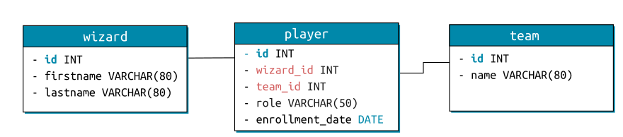

# SQL Quete 5 - Joins

## Schema



## Query 1

Retourne les noms, prénoms, rôle et équipe de tous les joueurs, classés  dans l’ordre alphabétique par équipe, puis par rôle dans l’équipe, puis  par nom de famille, puis par prénom.

#### Code

```mysql
SELECT 
  w.lastname AS wizard_lastname, 
  w.firstname AS wizard_firstname, 
  p.role, 
  t.name AS team_name
FROM 
  wizard AS w
JOIN 
  player p ON w.id=wizard_id
JOIN 
  team t ON p.team_id=t.id
ORDER BY
  t.name, p.role, w.lastname, w.firstname;
```

#### Results

| wizard_lastname | wizard_firstname | role   | team_name  |
| --------------- | ---------------- | ------ | ---------- |
| Black           | Sirius           | beater | Gryffindor |
| Brown           | Lavender         | beater | Gryffindor |
| Finnigan        | Seamus           | beater | Gryffindor |
| Hagrid          | Rubeus           | beater | Gryffindor |
| Longbottom      | Alice            | beater | Gryffindor |
| McGonagall      | Minerva          | beater | Gryffindor |
| Potter          | Harry            | beater | Gryffindor |
| Potter          | James            | beater | Gryffindor |
| Thomas          | Dean             | beater | Gryffindor |
| Weasley         | Arthur           | beater | Gryffindor |
| Weasley         | Percy            | beater | Gryffindor |
| Bell            | Katie            | chaser | Gryffindor |
| Dumbledore      | Albus            | chaser | Gryffindor |
| Granger         | Hermione         | chaser | Gryffindor |
| J.              | Lily             | chaser | Gryffindor |
| Jordan          | Lee              | chaser | Gryffindor |
| Longbottom      | Augusta          | chaser | Gryffindor |
| Longbottom      | Frank            | chaser | Gryffindor |
| Longbottom      | Neville          | chaser | Gryffindor |
| Pettigrew       | Peter            | chaser | Gryffindor |
| Spinnet         | Alicia           | chaser | Gryffindor |
| Weasley         | George           | chaser | Gryffindor |
| Wood            | Oliver           | chaser | Gryffindor |
|                 | Cadogan          | keeper | Gryffindor |
| Creevey         | Dennis           | keeper | Gryffindor |
| de              | Nicholas         | keeper | Gryffindor |
| Dumbledore      | Aberforth        | keeper | Gryffindor |
| Johnson         | Angelina         | keeper | Gryffindor |
| Weasley         | Ginevra          | keeper | Gryffindor |
| Binns           | Cuthbert         | seeker | Gryffindor |
| Creevey         | Colin            | seeker | Gryffindor |
| Gryffindor      | Godric           | seeker | Gryffindor |
| Vane            | Romilda          | seeker | Gryffindor |
| Weasley         | Fred             | seeker | Gryffindor |
| Weasley         | Ronald           | seeker | Gryffindor |
| Weasley         | William          | seeker | Gryffindor |
| Abbott          | Hannah           | beater | Hufflepuff |
| Finch-Fletchley | Justin           | beater | Hufflepuff |
| Friar           | Fat              | beater | Hufflepuff |
| Smith           | Hepzibah         | beater | Hufflepuff |
| Sprout          | Pomona           | beater | Hufflepuff |
| Tonks           | Nymphadora       | beater | Hufflepuff |
| Bones           | Amelia           | chaser | Hufflepuff |
| Scamander       | Newton           | chaser | Hufflepuff |
| Bones           | Susan            | keeper | Hufflepuff |
| Diggory         | Cedric           | keeper | Hufflepuff |
| Smith           | Zacharias        | keeper | Hufflepuff |
| Hufflepuff      | Helga            | seeker | Hufflepuff |
| Clearwater      | Penelope         | beater | Ravenclaw  |
| Quirrell        | Quirinus         | beater | Ravenclaw  |
| Ravenclaw       | Helena           | beater | Ravenclaw  |
| Warren          | Myrtle           | beater | Ravenclaw  |
| Chang           | Cho              | chaser | Ravenclaw  |
| Edgecombe       | Marietta         | chaser | Ravenclaw  |
| Flitwick        | Filius           | chaser | Ravenclaw  |
| Goldstein       | Anthony          | chaser | Ravenclaw  |
| Lockhart        | Gilderoy         | chaser | Ravenclaw  |
| Lovegood        | Luna             | chaser | Ravenclaw  |
| Lovegood        | Xenophilius      | chaser | Ravenclaw  |
| Ollivander      | Garrick          | chaser | Ravenclaw  |
| Corner          | Michael          | seeker | Ravenclaw  |
| Ravenclaw       | Rowena           | seeker | Ravenclaw  |
| Trelawney       | Sybill           | seeker | Ravenclaw  |
| Bulstrode       | Millicent        | beater | Slytherin  |
| Crabbe          | Vincent          | beater | Slytherin  |
| Flint           | Marcus           | beater | Slytherin  |
| Parkinson       | Pansy            | beater | Slytherin  |
| Snape           | Severus          | beater | Slytherin  |
| Zabini          | Blaise           | beater | Slytherin  |
| Baron           | Bloody           | chaser | Slytherin  |
| Lestrange       | Bellatrix        | chaser | Slytherin  |
| Lestrange       | Rodolphus        | chaser | Slytherin  |
| Malfoy          | Draco            | chaser | Slytherin  |
| Malfoy          | Lucius           | chaser | Slytherin  |
| Nigellus        | Phineas          | chaser | Slytherin  |
| Nott            | Theodore         | chaser | Slytherin  |
| Riddle          | Tom              | chaser | Slytherin  |
| Tonks           | Andromeda        | chaser | Slytherin  |
| Black           | Regulus          | keeper | Slytherin  |
| Goyle           | Gregory          | seeker | Slytherin  |
| Lestrange       | Rabastan         | seeker | Slytherin  |
| Malfoy          | Narcissa         | seeker | Slytherin  |
| Slytherin       | Salazar          | seeker | Slytherin  |
| Umbridge        | Dolores          | seeker | Slytherin  |

## Query 2

Retourne uniquement les prénoms et noms des joueurs ayant le rôle de *seeker* (attrapeur), classés par ordre alphabétique de nom puis prénom

#### Code

```mysql
SELECT
  w.lastname AS wizard_lastname,
  w.firstname AS wizard_firstname, 
  p.role
FROM 
  wizard AS w
JOIN 
  player p ON w.id=wizard_id
WHERE 
  p.role='seeker'
ORDER BY
  w.lastname, w.firstname;
```

#### Results

| wizard_lastname | wizard_firstname | role   |
| --------------- | ---------------- | ------ |
| Binns           | Cuthbert         | seeker |
| Corner          | Michael          | seeker |
| Creevey         | Colin            | seeker |
| Goyle           | Gregory          | seeker |
| Gryffindor      | Godric           | seeker |
| Hufflepuff      | Helga            | seeker |
| Lestrange       | Rabastan         | seeker |
| Malfoy          | Narcissa         | seeker |
| Ravenclaw       | Rowena           | seeker |
| Slytherin       | Salazar          | seeker |
| Trelawney       | Sybill           | seeker |
| Umbridge        | Dolores          | seeker |
| Vane            | Romilda          | seeker |
| Weasley         | Fred             | seeker |
| Weasley         | Ronald           | seeker |
| Weasley         | William          | seeker |

## Query 3

Retourne la liste de tous les sorciers qui ne pratiquent pas le quidditch.

#### Code

```mysql
SELECT
  w.id,
  w.lastname,
  w.firstname
FROM 
  wizard w
LEFT JOIN 
  player p ON w.id=p.wizard_id
WHERE 
  p.wizard_id IS NULL;
```

#### Results

| id   | lastname | firstname |
| ---- | -------- | --------- |
| 9    | Boot     | Terry     |
| 15   |          | Crabbe    |
| 45   | Lupin    | Remus     |
| 53   | Patil    | Padma     |
| 54   | Patil    | Parvati   |
| 63   | Robins   | Demelza   |
| 65   | Slughorn | Horace    |
| 80   | Weasley  | Charles   |
| 84   | Weasley  | Molly     |